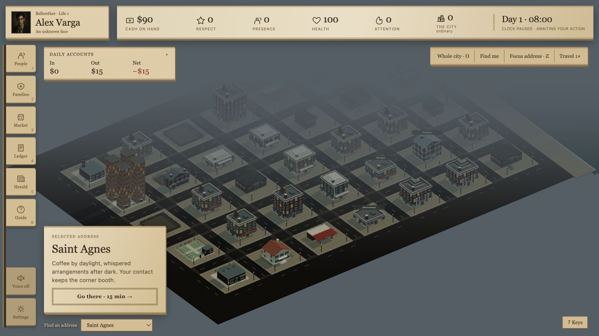
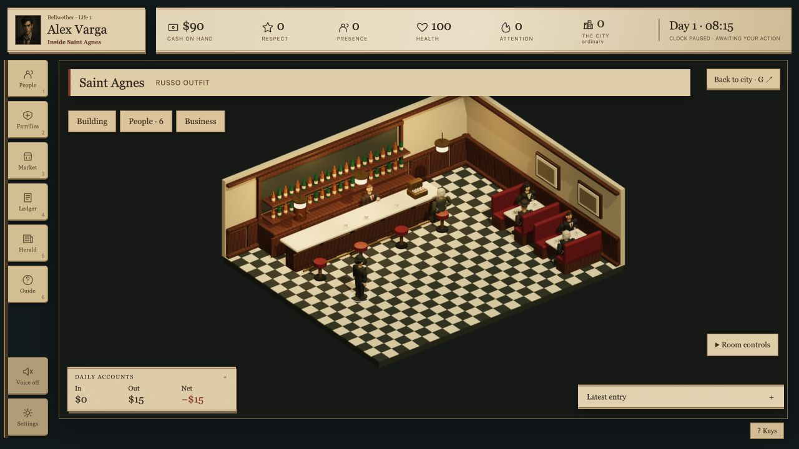
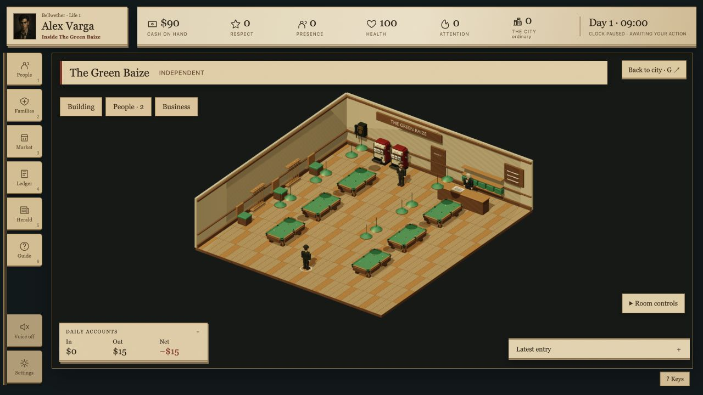

# Black Ledger

### An AI director. A city that remembers.

**Black Ledger is an experiment in AI-directed storytelling, built inside a
single-player 1950s mafia life sim.** A local AI director draws on your campaign
to create new encounters, while a persistent simulation gives those stories
people, relationships, money and consequences to work with.

That experiment is why Black Ledger exists: to explore how an AI director can
respond to an evolving game world and make each criminal career feel personal.
The game provides the rules and the stakes. The director proposes the stories
that unfold within them.

You start with a rented room and a little cash in Bellwether. Build contacts,
take jobs, buy businesses and put together a crew. Rivals hold grudges and the
police take an interest. If your character dies, another life begins in the
same city—with the history you helped create.

[Play the preview](#play-the-preview) · [The AI experiment](#the-ai-director-experiment) · [Features](#features) · [Screenshots](#screenshots) · [Build from source](docs/BUILDING.md)

*One city. More than one lifetime.*

## The AI director experiment

The director works with the campaign you're actually playing: available
contacts, existing relationships, places you can reach, and the record of
previous arrangements. It uses that context to propose new encounters and
conversations for your character.

- **Stories grounded in your campaign.** The director builds around people and
  places already in the city, with context from your progress and past dealings.
- **Choices with defined stakes.** Generated encounters go through game-side
  validation. The simulation controls money, time, rewards and outcomes, keeping
  the director's storytelling connected to playable decisions.
- **A voice for the cast.** Local speech generation gives characters consistent
  voices and lets the newspaper narrate the city's events.
- **An experiment you can run locally.** The director and voices run on your
  computer, without an account, subscription or cloud API. Once the models are
  installed, they work offline.

The current director creates contact-led **courier, collection and mediation
encounters**, including optional alternative approaches. Expanding and improving
that relationship between generated stories and the simulation is the heart of
the project. Narrative coherence remains an active area of development, and
feedback from real campaigns helps guide the experiment.

[How to enable the director](#set-up-the-ai-director-and-voices) · [How local AI works](docs/LOCAL_AI.md)

## Make your way in Bellwether

A discreet delivery can buy you another day's rent. A useful contact can open a
door. A business can give you steady income—and something a rival can threaten.
How far you go depends on the people you cultivate, the risks you take, and what
you can afford to lose.

Plan at your own pace: the game clock advances with your actions. Walk the
neighborhood, step inside its businesses, and decide what comes next.

## Features

- **An AI director at the heart of the project.** Experiment with locally
  generated encounters grounded in your campaign, alongside authored stories
  and a persistent world.
- **Rise from rented rooms to ownership.** Earn money, build respect, improve
  your living situation, and buy businesses and property.
- **Run an operation.** Manage income, stock, repairs and security. Recruit
  associates and dispatch operatives to collect proceeds, guard a property,
  handle maintenance or take on dangerous work.
- **Deal with the families.** Build relationships, negotiate protection for
  your businesses, navigate rivalries, and establish your own organization.
- **Live with the consequences.** Robberies, debts, retaliation, arrests and
  raids leave their mark. Violence can end your character's life permanently.
- **Return to a city that remembers.** Begin a new life without wiping the
  city's history. People, property and the aftermath of earlier lives persist.
- **Explore a 3D neighborhood.** Pan, rotate and zoom around Bellwether, follow
  street journeys, and enter its cafés, garages, homes and gambling venues.
- **Take a seat at the tables.** Play cards, dice, roulette and slots, or aim a
  shot in physical eight-ball. Enter pool tournaments—or arrange them as the
  hall's proprietor.
- **Read your city's story.** Follow events through the ledger and the
  *Bellwether Herald*, with newspaper reports shaped by what actually happened.

## Screenshots

Screenshots captured from the development build. Visuals and interface are still
being improved.

### Saint Agnes

Coffee by daylight, whispered arrangements after dark. Step inside to meet the
people behind the names.

### The Green Baize

A neighborhood pool hall with tables to play and a business to aspire to own.

## Play the preview

**Black Ledger is in active development.** Expect rough edges and changes to
visuals, balance and gameplay. This is a development preview, not a finished
1.0 release.

[GitHub Releases](https://github.com/JaTochNietDan/BlackLedger/releases) will host
published builds. In the meantime, development archives are available as
artifacts from successful [build runs](https://github.com/JaTochNietDan/BlackLedger/actions/workflows/build.yml).

| Platform | Build targets | Open after extracting |
| --- | --- | --- |
| Windows | x64 | `BlackLedger.exe` |
| macOS | Apple Silicon and Intel | `Black Ledger.app` |
| Linux | x64 and ARM64 | `BlackLedger` |

Extract the whole archive, then open the application. The game runs in its own
desktop window; no terminal or separate browser is needed. Keep supporting files
beside the executable on Windows and Linux. On macOS, you can move the app to
Applications. A working graphics driver is required.

Saves are automatic and stored separately from the application, so replacing the
game folder preserves your campaign. See [save locations and backups](docs/BUILDING.md#saves).
Current builds are unsigned, and macOS notarization is not yet configured.
Platform testing and other release checks are tracked in [release readiness](docs/RELEASING.md).

### Set up the AI director and voices

Choose **Download and enable AI** on first launch to set up the director and
voices automatically. No account, subscription, API key, Python or separate
Ollama installation is needed. After setup, AI works offline.

Allow roughly **10–12 GB of downloads** and about **20 GB of free disk space**
for installation. The director needs substantial memory and can be slow on
lower-end computers. Downloads resume after interruption and are verified before
installation.

You can choose **Play without AI** and enjoy authored encounters, then return
through **Game → AI setup** whenever you like. [More about local AI](docs/LOCAL_AI.md).

## Follow along or contribute

Have feedback from a campaign, found a bug, or want to help build Bellwether?
[Open an issue](https://github.com/JaTochNietDan/BlackLedger/issues) or read the
[contribution guide](CONTRIBUTING.md).

For developers: [build and run locally](docs/BUILDING.md), explore the
[simulation API](API.md), or read the [current goals](docs/GOAL.md).
The game uses Go and SQLite for its simulation and saves, React and Three.js
for its presentation, and Electron for desktop distributions.

## License

Original project code is **source-available under PolyForm Noncommercial 1.0.0**,
with attribution required by [NOTICE](NOTICE). Noncommercial use, modification
and redistribution are permitted subject to [LICENSE](LICENSE). Commercial use
requires a separate license; contact [JaTochNietDan](https://github.com/JaTochNietDan).
This is not an OSI open-source license. Dependencies retain their own licenses;
see [third-party notices](THIRD_PARTY_NOTICES.md) and [asset provenance](ASSETS.md).

*Contains fictional violence, crime, gambling and permanent character death.
No real-money gambling is involved.*
