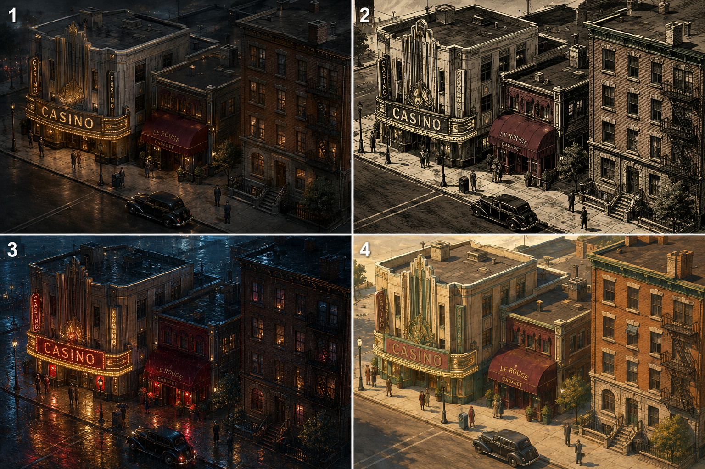
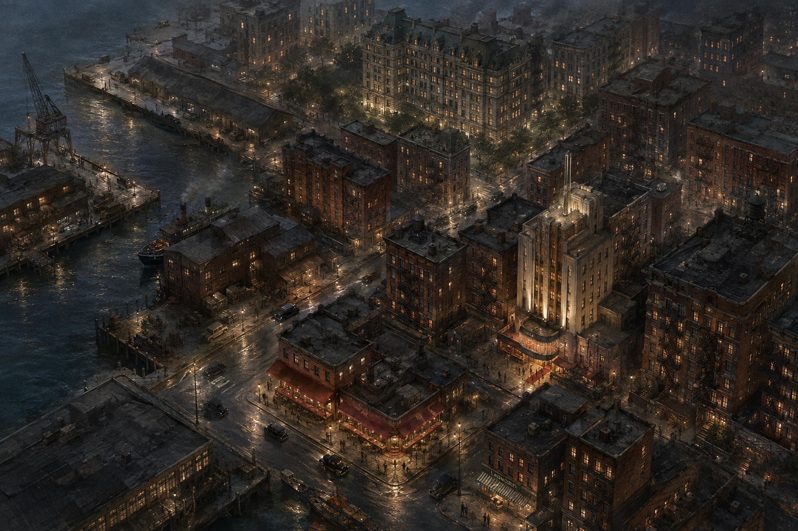

# Black Ledger visual handoff

Prepared 2026-09-07. This is a single-player browser mafia game, separate from the old Unity/Godot Afterlight project. The user has assigned visual production to a separate agent; Codex continues gameplay, simulation, AI direction, functional UX and playtesting. Read this document before editing.

## Intended result

Create a coherent, attractive painted noir city and interface. Think modern pre-rendered isometric crime strategy: realistic brick, stone, worn metal, understated signs, warm daylight, amber/crimson nightlife. The approved direction is **not** cartoon low-poly, green placeholder blocks or graphic-novel outlines. Keep the current React/browser platform and modular 2D approach. No realtime combat, navigation AI, physics or engine migration is required.

Use these existing references, in order:

1. [Approved style comparison](art/style-comparison-v1.png): panel 1 materials/realism, panel 4 daylight, panel 3 nightlife. Panel 2 ink treatment was not chosen.
2. [Original city direction](art/city-direction-v1.png): intended overall mood and city density; a reference, not the playable map.
3. [Casino asset study](../public/art-study.html), served at `/art-study.html`: useful benchmark for a finished-looking individual building and restrained lighting.
4. [Street assembly](../public/street-study.html), served at `/street-study.html`: current compositing implementation; **not** final visual quality.
5. [Art direction](ART_DIRECTION.md) and [asset manifest](../public/art/buildings.json).





## Current state and priority defects

Five painted Old Harbor landmarks are integrated: Saint Agnes (`bar`), The Monarch (`club`), Bluebird Laundry (`laundry`), The Mariner (`room`), Mercer Exchange (`market`). Pier 14 (`docks`), Ashbury Court (`apartment`), Russo Motor Works (`garage`), The Blue Hour (`casino`) and Cypress House (`estate`) still need consistent art. Do not depict an unpainted district by relabeling an unrelated building.

First finish one convincing block before producing many assets:
- Improve building/actor occlusion. Whole-sprite depth anchors are approximate; pedestrians can overlap buildings unnaturally. Use clear ground footprints and foreground occlusion layers if needed.
- Replace crude procedural pedestrians; match period, scale, perspective and lighting to the buildings. Decorative actors need only authored routes and inexpensive animation.
- Check transparency and mask edges at all scales. Mercer and the damaged laundry have generated opaque/checkerboard backgrounds masked at runtime. A checkerboard drawn into a PNG is not transparency.
- Improve streets, pavements, building grounding, contact shadows and empty lots. A recent fix removed repeated asphalt seams and crossing curb lines. Preserve the open junction; avoid reintroducing these defects.
- Make night windows, lamps and signs feel attached to the architecture. Use per-asset anchors/masks rather than arbitrary screen-space glows. Night brightness must apply to people and vehicles too.
- Improve consistent UI skin, hierarchy, portraits and compact iconography. Preserve legibility of prices, durations and consequences. Do not hide critical stakes to reduce text.
- Expand the portrait cast: the 3×2 painted atlas is Mara/Leo/Vittorio, Elena/Harlow/Alex. Later player identities currently use a fallback.

Recent header/framing fixes put controls in normal flow, the street iframe at the canvas aspect ratio, and the property placeholder on a neutral architectural symbol. Check these rather than restoring old absolute offsets. CSS has accumulated overrides and deserves careful consolidation, with before/after screenshots.

## Working files and ownership

Visual-owned:
- `public/art/`: sprites, masks, `buildings.json`, `previews.json`, `street-study.js`, `hit-test.js`.
- `public/art-study.html`, `public/street-study.html`.
- `src/style.css`, `src/cityAssets.ts`, `src/art.ts` (legacy fallback art; not all exports are actively used).
- `src/StreetScene.tsx`, `src/CityDirectory.tsx`, and new presentation-only components.
- `docs/ART_DIRECTION.md`, visual production notes, asset provenance and screenshot evidence.

Coordinate shared-file changes:
- `src/main.tsx` combines shell markup with command submission, focus, speech and idempotency handling. Extract presentational components when useful; avoid rewriting command logic while reskinning.
- `src/types.ts` and `API.md` are contracts. Request additions through a documented proposal; do not silently change field meanings.
- Codex owns `core/`, `store/`, `sim/`, `cmd/`, gameplay tests and director/voice behavior. If visuals uncover a functional bug, record it for Codex rather than inventing client-side rules.

No external publication, purchases, backend migration, user-save modification or unrelated Unity work is part of this handoff.

## Preview safely

Use the prepared `codex/visual-handoff` worktree, not the gameplay checkout. Its location is beside `mafia-game`, named `mafia-game-visuals`.

```sh
./scripts/run-visual-preview.sh damage
```

This builds its own frontend/server, creates or reuses `.runtime/visual-preview-damage.sqlite3`, and serves port **8840**. It does not use `.runtime/campaign.sqlite3` or the user's port **8791**. Other supported fixtures: `police`, `warning`, `russo-warning`, `attack`, `voice`. A fixture is a deliberately staged visual test, not evidence of an earned campaign.

Choose a different unused `BLACK_LEDGER_PORT` for concurrent previews. Existing fixture saves are reused; choose a different scenario or explicitly create a new fixture file if a pristine state is needed. Do not delete saves to reset them. Dependencies are installed from the lockfile if absent. Go must be on PATH or installed at `/usr/local/go/bin/go`.

`npm run dev` alone is not the current full game preview: the Go server serves `dist/` and the API together. Rebuild frontend edits with `npm run build`, then reload; backend changes are outside visual scope.

The AI and speech services are optional. Visual development must work with both offline. Do not require cloud credentials to inspect the city.

## Non-negotiable presentation boundary

Go owns money, health, time, ownership, factions, jobs, saves and outcomes. Browser state owns selection, camera/view, animation progress and visual/audio preferences.

- Inspecting a destination, toggling views or reading a panel must not advance time.
- Only `POST /api/action` commits decisions, using the existing `request_id` and `revision` flow. Never bypass this for a visual effect.
- `last_result` is already committed. Animate its travel endpoints, records and optional cues; skip/replay changes presentation only.
- Do not expose hidden plots. Show `known_threats` only when supplied by the public API; no invented countdowns or private database queries in the frontend.
- Dialogue text/options come from the saved event. Keep focus trapping, disabled choices, stale-response protection and speech cancellation intact.
- A replaced frontend must remain a client of the same API. See `API.md`, `src/types.ts` and `docs/ARCHITECTURE.md`.

`StreetScene.tsx` hosts an isolated canvas iframe. Parent → frame uses `blackledger:presentation` with selected location, saved minute, public property conditions, player position, cosmetic motion, optional journey and committed sequence. Frame → parent sends `blackledger:ready`, `blackledger:art-error`, or `blackledger:inspect` with a whitelisted location. Check both source window and origin; do not broaden message permissions.

## Asset production rules

Record file provenance/licensing. Existing generated art is local to this repository; do not assume the older project's purchased packs can be redistributed. Do not publish source packs.

Preserve approved originals; create named variants and metadata. Verify actual alpha channels, dimensions and edge pixels. The street's design space is 1280×820. Manifest `x/y/w/h` place sprites; `depth` orders drawing; `door` is a ground entrance point; `walkway` defines decorative travel; optional `mask` and `damage` select cutouts/condition variants. Current hit picking samples alpha rather than selecting an entire rectangular image. Keep asset IDs identical to API location IDs.

Assets can be generated with whichever image tools the visual agent actually has. Do not claim images were generated if only a plan was written. Never substitute a static full-city picture for working selectable destinations and committed travel.

## Delivery and integration

Commit small coherent changes on the visual branch. Record commit hashes, screenshots, inspected viewport sizes, commands run, remaining defects and any API requests in `docs/VISUAL_DELIVERY.md`. Do not merge into gameplay `main`; Codex will review and integrate selected commits. Rebase only with awareness of shared-file changes. An interface incompatibility should be documented, not hidden behind fake state.

Acceptance: use [VISUAL_ACCEPTANCE.md](VISUAL_ACCEPTANCE.md). A pretty screenshot alone is not sufficient.

Gameplay integration note (2026-09-07): main now adds an optional `business_truces` expiry map to `Snapshot` and a short active-agreement status in each Families card (`src/types.ts`, `src/main.tsx`). Preserve this functional status when integrating visual layout changes; the public API contract is in API.md. No visual-agent worktree files were changed.

### Additional functional UI to preserve
The gameplay branch now shows the existing public `known_threats` on Families as well as City, alongside business-ceasefire terms. Preserve that warning when restyling; standing alone does not cancel a reported hit. People resolves family-leader affiliation from the supplied factions and labels Harlow as a city authority. These are small `src/main.tsx` changes; no art or API schema changed.

On boot, the gameplay client now selects the player's current public location, using the directory if it lacks street art. A brand-new person in the starting room is still directed toward Saint Agnes. Preserve this useful reload behavior when replacing navigation. No simulation state is stored in the view.
